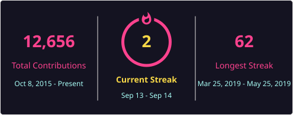
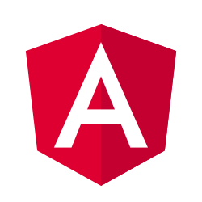
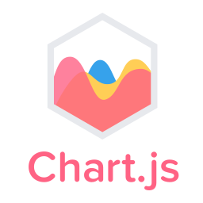

<h1 align="center">Hi 👋, I'm Ramandeep Singh</h1>
<h3 align="center">A Fullstack developer</h3>

  Fullstack developer working primarily with <strong>Rails, Node.js, and React</strong>,
  currently exploring <strong>GoLang</strong> and <strong>GraphQL</strong>, and containerizing projects with <strong>Docker</strong>.

<!-- Social quick links -->

  
  
  

  

<!-- GitHub Trophies -->

  

<!-- Brief intro -->
<ul>
  <li>🔭 I'm currently working on <strong>Rails project</strong></li>
  <li>🌱 I'm currently learning <strong>GoLang</strong></li>
  <li>👯 I'm looking to collaborate on <strong>Remote open source</strong></li>
  <li>💬 Ask me about <strong>Rails, Node, React, Docker</strong></li>
  <li>📄 Know about my experiences <a href="https://linkedin.com/in/raman-gosal7">linkedin.com/in/raman-gosal7</a></li>
</ul>

<!-- GitHub Stats -->
<h3>📊 GitHub Stats</h3>

<!-- Self-hosted metrics (updated weekly by GitHub Actions) -->

  

<!-- Streak (self-hosted via DenverCoder1/github-readme-streak-stats) -->
<h3>🔥 Contribution Streak</h3>

  

<!-- Most Used Languages (self-hosted via github-readme-stats-action, compact) -->
<h3>💻 Most Used Languages</h3>

  

<!-- Languages and Tools -->
<h3 align="left">Languages and Tools:</h3>

<h4>Frontend:</h4>
  

    
    
    
    
    
    
    
    
  

  <h4>Backend:</h4>
  

    
    
    
    
    
    
  

  <h4>Databases:</h4>
  

    
    
    
    
    
  

  <h4>DevOps & Tools:</h4>
  

    
    
    
    
    
  

  <h4>Editors & IDEs:</h4>
  

    
    
    
  

  <h4>AI Tools:</h4>
  

    
    
    
    
    
    
    
  

